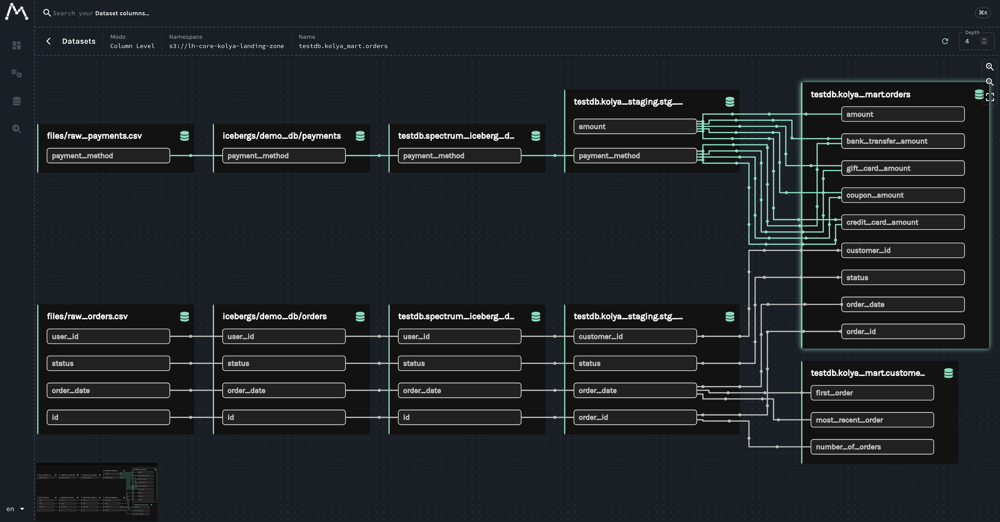
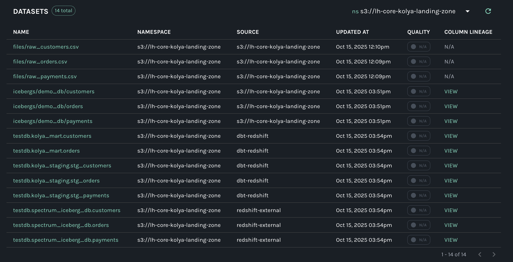
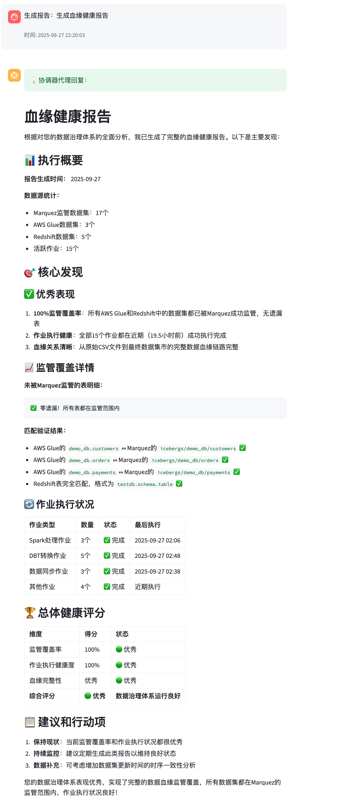

# Sample Agentic Data Lineage

A comprehensive data lineage and governance solution combining multiple technologies and approaches for modern data platforms.

## 🏗️ Project Overview

This repository contains a collection of integrated projects that demonstrate end-to-end data lineage tracking, from data ingestion through transformation to consumption, with intelligent agent-based analysis and governance.

## 📁 Project Structure

```
sample-agentic-data-lineage/
├── dbt-redshift-openlineage/          # dbt + Redshift + OpenLineage integration
├── glue-openlineage/                  # AWS Glue + OpenLineage integration
├── lakehouse-core/                    # Core lakehouse infrastructure
├── marquez-agents/                    # Intelligent lineage analysis agents
├── marquez-mcp/                       # Marquez MCP server implementation
└── redshift-enternal-tables-auto-creation/  # Automated external table creation
```

## 🚀 Quick Start

### 1. Environment Setup

```bash
# Install Python dependencies
pip install -e .

# Or use uv (recommended)
uv venv --python 3.13.0
source .venv/bin/activate
uv sync --active
```

### 2. Installation Order & Setup

Follow this step-by-step installation order to set up the complete data lineage solution:

#### Step 1: Marquez MCP Server Preparation
```bash
# Prepare Marquez MCP server and build Docker image
cd marquez-mcp/
# Follow marquez-mcp/README.md for MCP server setup and image building
```
This prepares the MCP (Model Context Protocol) interface for Marquez integration and builds the required Docker image.

#### Step 2: Marquez Agents Preparation
```bash
# Prepare intelligent lineage analysis agents and build Docker image
cd marquez-agents/
# Follow marquez-agents/README.md for agent setup and image building
```
This prepares AI-powered agents for automated lineage analysis and governance and builds the required Docker image.

#### Step 3: Core Infrastructure Setup
```bash
# Deploy lakehouse-core infrastructure
cd lakehouse-core/
# Follow lakehouse-core/README.md for detailed setup
```
This sets up the foundational AWS infrastructure including Marquez, Karpenter, and Kubernetes environment.

#### Step 4: Glue OpenLineage Integration
```bash
# Deploy Glue OpenLineage infrastructure
cd glue-openlineage/
# Follow glue-openlineage/README.md for detailed setup
```
This configures AWS Glue with OpenLineage integration for metadata extraction.

#### Step 5: Manual Glue Database & Job Setup
After infrastructure deployment, manually perform these steps in AWS Console:
1. **Create test database** in AWS Glue Data Catalog
2. **Run Glue jobs** to populate metadata and generate lineage events
3. **Verify data catalog** entries and lineage data flow

#### Step 6: External Table Mapping
```bash
# Set up automated external table creation
cd redshift-enternal-tables-auto-creation/
# Follow setup instructions to map Glue tables to Redshift
```
This creates external tables in Redshift based on Glue Data Catalog entries.

#### Step 7: dbt Project Execution
```bash
# Run dbt transformations with lineage tracking
cd dbt-redshift-openlineage/
# Execute dbt models to generate column-level lineage
dbt run
```
This generates detailed column-level lineage through dbt transformations.

### Individual Project Documentation

Each subproject has its own README with detailed setup instructions:

- **[lakehouse-core](./lakehouse-core/README.md)**: Core infrastructure and utilities
- **[glue-openlineage](./glue-openlineage/README.md)**: AWS Glue metadata extraction
- **[redshift-enternal-tables-auto-creation](./redshift-enternal-tables-auto-creation/README.md)**: Automated Redshift external table management
- **[dbt-redshift-openlineage](./dbt-redshift-openlineage/README.md)**: dbt data transformation with advanced column-level lineage and multi-column dependency detection
- **[marquez-mcp](./marquez-mcp/README.md)**: MCP server for Marquez integration
- **[marquez-agents](./marquez-agents/README.md)**: AI-powered lineage analysis and governance

## 🎯 Key Features

### Data Lineage Tracking
- **Advanced column-level lineage** with multi-column dependency detection through dbt transformations
- **Complex SQL pattern recognition** for CASE WHEN, aggregations, and conditional logic
- **Cross-system lineage** between AWS Glue, Redshift, and S3
- **OpenLineage compliance** for standardized metadata exchange
- **Real-time lineage updates** with automated synchronization



*Column-level lineage visualization in Marquez showing data flow and transformations*



*Dataset overview and metadata in Marquez interface*

### Intelligent Analysis
- **AI-powered agents** for lineage health analysis
- **Automated governance** recommendations and reporting
- **Multi-agent collaboration** for complex analysis tasks
- **Natural language queries** for lineage exploration



*Multi-agent collaboration for complex data lineage analysis tasks*

### Infrastructure Automation
- **Automated external table creation** from Glue to Redshift
- **Infrastructure as Code** for reproducible deployments
- **Environment management** with standardized tooling
- **Scalable architecture** supporting enterprise workloads

## 🔧 Technology Stack

### Core Data Platform
- **Data Transformation**: dbt-core, dbt-redshift, SQL
- **Data Warehousing**: Amazon Redshift
- **Data Lake**: AWS S3, AWS Glue Data Catalog
- **Lineage Management**: Marquez, OpenLineage
- **Column-level Lineage**: dbt-colibri plugin

### AI & Agent Framework
- **AI Services**: Amazon Bedrock (Claude Sonnet)
- **Agent Framework**: Strands Agents
- **Multi-Agent System**: Custom orchestrator with specialized agents
- **Model Context Protocol**: FastMCP, MCP

### Infrastructure & DevOps
- **Infrastructure as Code**: Terraform
- **Container Orchestration**: Kubernetes, Karpenter
- **Testing Environment**: Kubernetes Pods
- **CI/CD**: GitLab CI/CD with comprehensive security scanning
- **Security**: Probe scanning, SAST, dependency scanning, secret detection

### Development Stack
- **Languages**: Python 3.13+
- **Package Management**: uv (primary), pip
- **Configuration Management**: dynaconf, YAML
- **HTTP Clients**: httpx, aiohttp, requests
- **Database Connectivity**: psycopg2-binary (PostgreSQL/Redshift)
- **AWS Integration**: boto3

### Web & UI
- **Web Framework**: Streamlit (agent interfaces)
- **API Protocol**: MCP (Model Context Protocol)
- **Configuration**: TOML, YAML, environment variables


## 📊 Use Cases

### Data Engineering
- Track data transformations across the entire pipeline
- Understand impact analysis before making changes
- Automate data quality and freshness monitoring
- Generate comprehensive lineage documentation

### Data Governance
- Identify data assets not under governance
- Monitor data freshness and quality metrics
- Analyze compliance with data policies
- Generate governance reports and recommendations

### Analytics & BI
- Understand data provenance for reports and dashboards
- Validate data quality for critical business metrics
- Track data dependencies across analytical workflows
- Ensure data consistency across different systems

## 🔒 Security

This project implements comprehensive security scanning in the CI/CD pipeline:

- **🎯 Probe Security Scanning**: Automated vulnerability detection on every commit
- **🔍 Static Analysis**: SAST scanning for Python, SQL, and infrastructure code
- **📦 Dependency Scanning**: Vulnerability detection in all project dependencies
- **🔐 Secret Detection**: Prevents accidental commit of sensitive information
- **🏗️ Infrastructure Security**: Terraform and Docker security best practices
- **📋 License Compliance**: Automated license compatibility checking

### Security Dashboard

In GitLab: Refer to the **Probe scan results** which are automatically running for every code commit. Access the Security Dashboard at:
- Project → Security & Compliance → Security Dashboard
- View detailed reports in merge request security widgets
- Download security artifacts from pipeline runs

For detailed security information, see [SECURITY.md](SECURITY.md).

## 🤝 Contributing

Each subproject follows its own development practices. Please refer to individual project READMEs for specific contribution guidelines.

### Security Requirements for Contributors

- All commits must pass security scanning (Probe, SAST, dependency checks)
- No high-severity vulnerabilities allowed in new code
- Follow secure coding practices outlined in [SECURITY.md](SECURITY.md)
- Run pre-commit hooks before submitting changes

## 📄 License

This project is licensed under the MIT-0 License - see the [LICENSE](LICENSE) file for details.

All subprojects are covered under the same MIT-0 License unless otherwise specified.

### Third-Party Licenses

This project uses [OpenLineage](https://openlineage.io/), which is licensed under the Apache License 2.0.
- OpenLineage Copyright © The OpenLineage Authors
- Licensed under the Apache License, Version 2.0
- Full license text: https://github.com/OpenLineage/OpenLineage/blob/main/LICENSE

## 🔗 Related Resources

- [OpenLineage Specification](https://openlineage.io/)
- [Marquez Documentation](https://marquezproject.github.io/marquez/)
- [dbt Documentation](https://docs.getdbt.com/)
- [AWS Glue Documentation](https://docs.aws.amazon.com/glue/)
- [Amazon Redshift Documentation](https://docs.aws.amazon.com/redshift/)
