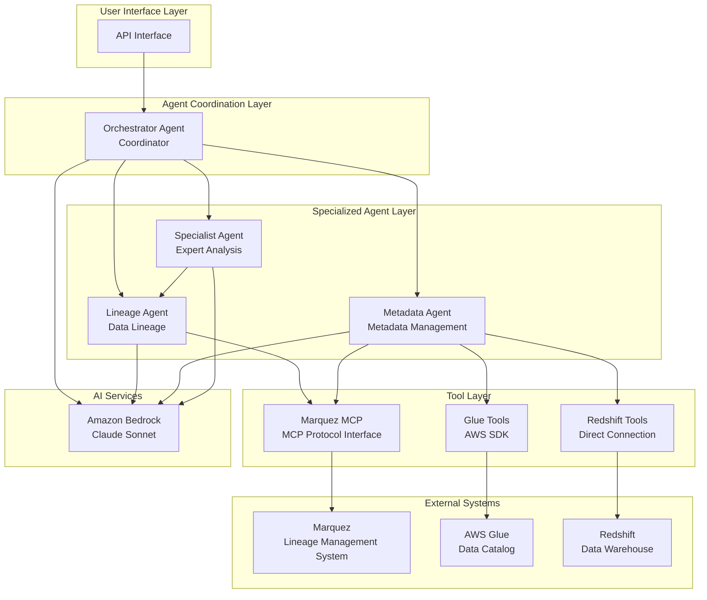

# Agentic Lineage For Lakehouse

Intelligent Data Lineage Analysis System - Multi-Agent Architecture

## 🏗️ System Architecture

A multi-agent collaborative system built on the Strands Agent framework, integrating data sources such as Marquez, AWS Glue, and Redshift to provide intelligent data governance solutions.



### Core Components

- **🎯 Orchestrator Agent**: Intelligently routes user requests to appropriate specialized agents
- **📊 Metadata Agent**: Statistics and queries for assets and jobs information in Marquez
- **📈 Lineage Agent**: Analyzes data lineage relationships and impact scope
- **🔍 Specialist Agent**: Generates lineage health reports and governance recommendations

## 🚀 Quick Start

### 1. Environment Setup

```bash
# Install Python dependencies
pip install -e .

# Or use uv
uv venv --python 3.13.0
source .venv/bin/activate
uv sync --active
```

### 2. Prerequisites
- Python 3.13+
- Configure AWS credentials
- Access to Marquez system

### 3. Launch Web Interface
```bash
python run_streamlit.py
```
Access: http://localhost:8504

### 4. Launch Console Interface
```bash
python run_console.py
```

## 🤖 Agent Functionality Details

### 1. Orchestrator Agent (Coordinator)
- **Intelligent Coordination**: Organizes and coordinates workflows across specialized agents
- **User Interaction**: Serves as the primary interface between users and the system, understanding user intent and distributing tasks
- **Request Routing**: Intelligently selects the most appropriate specialized agent based on query type

### 2. Lineage Agent (Data Lineage)
- **Field Tracing**: ETL engineers can inquire about the origin of any field, with the system providing clear, structured responses about field lineage relationships
- **Impact Analysis**: When ETL engineers perform CRUD operations on fields, analyzes and reports which downstream tables and fields will be affected
- **Lineage Visualization**: Provides clear data lineage relationship graphs and dependency analysis

### 3. Metadata Agent (Metadata Management)
- **Asset Statistics**: Statistics on assets and jobs count through Marquez MCP calls, supporting both summary and daily aggregation
- **Data Catalog Integration**:
  - Access AWS Glue to retrieve all database and table information from the data lake
  - Access Redshift to retrieve all database and table information from the data warehouse
  - These two parts constitute the enterprise's complete data asset inventory

### 4. Specialist Agent (Expert Analysis)
Generates comprehensive data lineage health reports using data obtained through the Lineage Agent:

- **Assets Not in Lineage**: Identifies enterprise data assets not managed in the Marquez system
- **Invalid Asset Detection**: Discovers anomalous nodes where downstream assets have earlier update times than upstream assets
- **Invalid Job Identification**: Detects job tasks related to invalid assets
- **Job Execution Monitoring**:
  - Identifies jobs that haven't executed today
  - Discovers jobs that haven't executed for extended periods
- **Asset Freshness Analysis**: Identifies data assets that haven't been updated for long periods, evaluating data timeliness

## 📁 Project Structure

```
src/
├── agents/          # Agent implementations
├── core/           # Core system
├── ui/             # User interface
├── utils/          # Utility modules
├── i18n/           # Internationalization
└── config/         # Configuration management
```

## 🧪 Testing

```bash
python run_tests.py  # Run all tests
```

## License

This project is licensed under the MIT License - see the [LICENSE](../LICENSE) file in the root directory for details.
